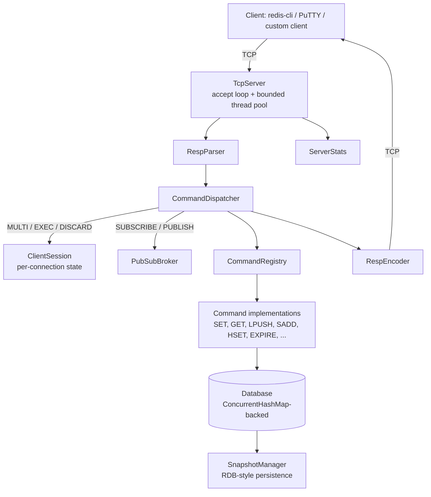

# JRedis

A mini Redis-compatible in-memory key-value store, built from scratch in Java on Spring Boot — raw TCP sockets, a hand-rolled RESP protocol implementation, a concurrent storage engine, transactions, pub/sub, and RDB-style persistence, without wrapping an existing Redis server or using a Redis client library internally.

## Features

- Custom implementation of the Redis Serialization Protocol (RESP) — parser and encoder for all 5 value types
- Multi-client TCP server (bounded thread pool, configurable size)
- Data types: Strings, Lists, Sets, Hashes
- Key expiration (TTL) with both lazy and active expiration
- Transactions (`MULTI`/`EXEC`/`DISCARD`)
- Publish/subscribe messaging (`SUBSCRIBE`/`UNSUBSCRIBE`/`PUBLISH`)
- RDB-style snapshot persistence with atomic file writes and load-on-startup
- Server introspection (`INFO`, `COMMAND`, `FLUSHDB`, `TIME`)
- Structured logging (SLF4J/Logback) with per-command latency and error tracking
- Configurable port, connection limit, persistence location, and snapshot interval
- Unit, integration, and end-to-end test coverage
- Multi-stage Docker build

## Architecture



| Package | Responsibility |
|---|---|
| `server` | TCP accept loop, per-connection threading, `ServerStats` |
| `protocol` | RESP parsing and encoding |
| `command` | Command interface, registry, dispatcher, transactions, pub/sub |
| `storage` | The `Database` engine and its `RedisValue` type hierarchy |
| `persistence` | Snapshot save/load |
| `config` | `ServerConfig`, bound from `application.properties` / env vars / CLI args |

## How Redis Works, and Where JRedis Deliberately Differs

Real Redis is single-threaded for command execution, using an event loop built on OS-level I/O multiplexing (epoll/kqueue) to serve many connections from one thread without ever blocking. JRedis uses thread-per-connection with a bounded pool instead — a deliberate choice to make the concurrency model concrete and learnable (real threads, real race conditions, real fixes), at the cost of the throughput a single-threaded event loop achieves. Both speak the same RESP wire protocol, so any RESP-aware client can talk to either.

## Supported Commands

| Category | Commands |
|---|---|
| Connection | `PING`, `ECHO` |
| Strings | `SET` (with optional `EX`), `GET`, `INCR`, `DECR` |
| Keys | `DEL`, `EXISTS`, `KEYS`, `DBSIZE`, `EXPIRE`, `TTL`, `PTTL`, `PERSIST` |
| Lists | `LPUSH`, `RPUSH`, `LPOP`, `RPOP`, `LRANGE`, `LLEN` |
| Sets | `SADD`, `SREM`, `SISMEMBER`, `SMEMBERS` |
| Hashes | `HSET`, `HGET`, `HDEL`, `HGETALL`, `HEXISTS` |
| Transactions | `MULTI`, `EXEC`, `DISCARD` |
| Pub/Sub | `SUBSCRIBE`, `UNSUBSCRIBE`, `PUBLISH` |
| Server | `INFO`, `COMMAND`, `FLUSHDB`, `TIME`, `SAVE`, `BGSAVE` |

## Protocol: RESP

All 5 RESP types are modeled as a sealed interface (`RespValue`, implemented by `RespSimpleString`, `RespError`, `RespInteger`, `RespBulkString`, `RespArray`), giving the compiler exhaustiveness checking over every value the protocol can produce. `RespParser` and `RespEncoder` handle the wire format in both directions — length-prefixed Bulk Strings for binary-safety-in-spirit, recursive parsing for nested Arrays, and strict `\r\n` framing throughout.

## Concurrency Model

The storage engine is one `ConcurrentHashMap<String, RedisValue>`. Every mutating operation on a single key — `INCR`, list pushes/pops, set/hash mutations — is routed through `ConcurrentHashMap.compute()`, which the JDK guarantees is atomic per key. This project adds **zero** explicit locks (`synchronized`, `ReentrantLock`) for data-structure safety; the one exception is `synchronized` around each connection's socket writer, needed once pub/sub let other clients' threads push messages onto a connection they don't own.

**Known limitation, stated plainly**: individual commands inside a `MULTI`/`EXEC` block stay atomic, but the transaction as a whole is not isolated from other clients — the server is multi-threaded, so another connection's commands can interleave with an in-progress `EXEC`. Real Redis avoids this by being single-threaded for command execution.

## Persistence Model

RDB-style: a full snapshot of the keyspace, written on `SAVE`/`BGSAVE` or an optional timer, in a small custom binary format (`DataOutputStream`/`DataInputStream`, no external serialization library). Writes go to a temp file and are atomically moved into place, so a crash mid-write never corrupts the previous good snapshot. Loaded automatically on startup. No append-only log (AOF) — see Limitations.

## Performance

Measured with a standalone benchmark client (`Benchmark.java`) against a running local instance — 50 concurrent clients, 1,000 operations each, no pipelining:

| Command | Throughput | p50 | p95 | p99 |
|---|---|---|---|---|
| SET | ~21,000 ops/sec | 0.116ms | 0.962ms | 3.312ms |
| GET | ~30,000 ops/sec | 0.034ms | 0.085ms | 0.246ms |

For context, not as a target: real Redis's own benchmark tooling typically reports 100,000+ ops/sec for plain SET/GET without pipelining on modern hardware. The gap is architectural, not incidental — Redis's single-threaded event loop avoids per-connection blocking I/O and thread scheduling overhead entirely, and real-world clients typically pipeline multiple commands per round trip, which this benchmark deliberately does not.

## Testing

Three explicit categories:
- **Unit** — one class in isolation (most `command/*Test.java` files)
- **Integration** — several real collaborators wired together in-process (`TransactionTest`, `ConcurrencyStressTest`, `SnapshotManagerTest`)
- **End-to-end** — a real socket, real RESP bytes, against an actual running `TcpServer` (`EndToEndTest`)

```
mvn clean test
```

## Running Locally

```
./mvnw spring-boot:run
```
Connect with any raw TCP client — PuTTY (Connection type: Raw, host `localhost`, port `6380`) works well for manual testing.

## Running with Docker

```
docker build -t jredis:latest .
docker run -p 6380:6380 jredis:latest
```
For persistence that survives container removal, mount a volume:
```
docker run -p 6380:6380 -v jredis-data:/app/data -e JREDIS_PERSISTENCE_DIRECTORY=/app/data jredis:latest
```

## Limitations

Stated directly rather than discovered the hard way:
- No AOF persistence — only point-in-time RDB-style snapshots
- No `WATCH` — no optimistic-concurrency support for transactions
- Transactions aren't isolated from other clients' concurrent commands (see Concurrency Model)
- Values are `String`-backed, not `byte[]` — not truly binary-safe like real Redis
- `KEYS` doesn't support glob patterns; always returns every key
- `DEL`/`EXISTS` accept exactly one key, not the variadic form real Redis supports
- `SUBSCRIBE`/`UNSUBSCRIBE` reply with one summary message rather than real Redis's one-reply-per-channel behavior
- No enforcement that a subscribed connection is restricted to pub/sub commands
- No authentication, no TLS, no replication or clustering

## Future Improvements

- Append-only file (AOF) persistence alongside RDB snapshots
- `WATCH` for optimistic transaction concurrency
- Binary-safe values (`byte[]` instead of `String`)
- Glob pattern support for `KEYS`, variadic `DEL`/`EXISTS`
- A real RESP-speaking benchmark/CLI client instead of relying on PuTTY or raw sockets